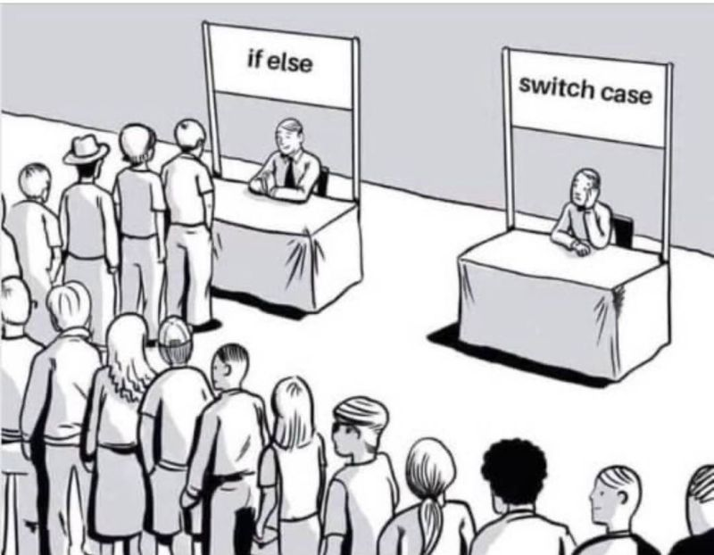
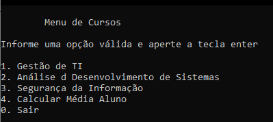

</p>
<h1 align="center">
    
</h1>

<h4 align="center"> 
	🚧  Template ♻️ Concluído 🚀 🚧
</h4>

<p align="center">
 <a href="#-sobre-o-projeto">Sobre</a> •
 <a href="#-funcionalidades">Funcionalidades</a> •
 <a href="#-layout">Layout</a> • 
 <a href="#-como-executar-o-projeto">Como executar</a> • 
 <a href="#-tecnologias">Tecnologias</a> • 
 <a href="#-contribuidores">Contribuidores</a> • 
 <a href="#-autor">Autor</a> • 
 <a href="#user-content--licença">Licença</a>
</p>


## 💻 Sobre o projeto

Detalhamento do Projeto

---

## ⚙️ Funcionalidades

- [x] Empresas ou entidades podem se cadastrar na plataforma desenvolvida na linguagem C enviando:
  - [x] nome da empresa, email e whatsapp
  - [x] funcionários podem visualizar: 
    - cursos
    - professores    

- [x] Os celintes tem acesso ao software, onde podem:
  - [x] visualizar os seus cursos
  - [x] receber atualizações sobre o curso

---

## 🎨 Layout

### Console

<p align="center">
    
</p>

---

## 🚀 Como executar o projeto

Descrever passos iniciais para a execução do projeto

### Pré-requisitos

Descrever ferramentas/softwares necessários para que o software seja executado.

#### 🎲 Rodando a aplicação

```bash

# Clone este repositório
$ git clone git@github.com:salatielmarinho/README.git

```
---

## 🛠 Tecnologias

As seguintes ferramentas foram usadas na construção do projeto:

#### **Console**  

-   **[Linguagem C](https://learn.microsoft.com/pt-br/cpp/c-language/?view=msvc-170)**

---

## 👨‍💻 Contribuidores


## 🦸 Autor


---

## 📝 Licença

Feito com ❤️ por Salatiel Luz Marinho 👋🏽 [Entre em contato!](https://www.linkedin.com/in/salatielmarinho/)

---